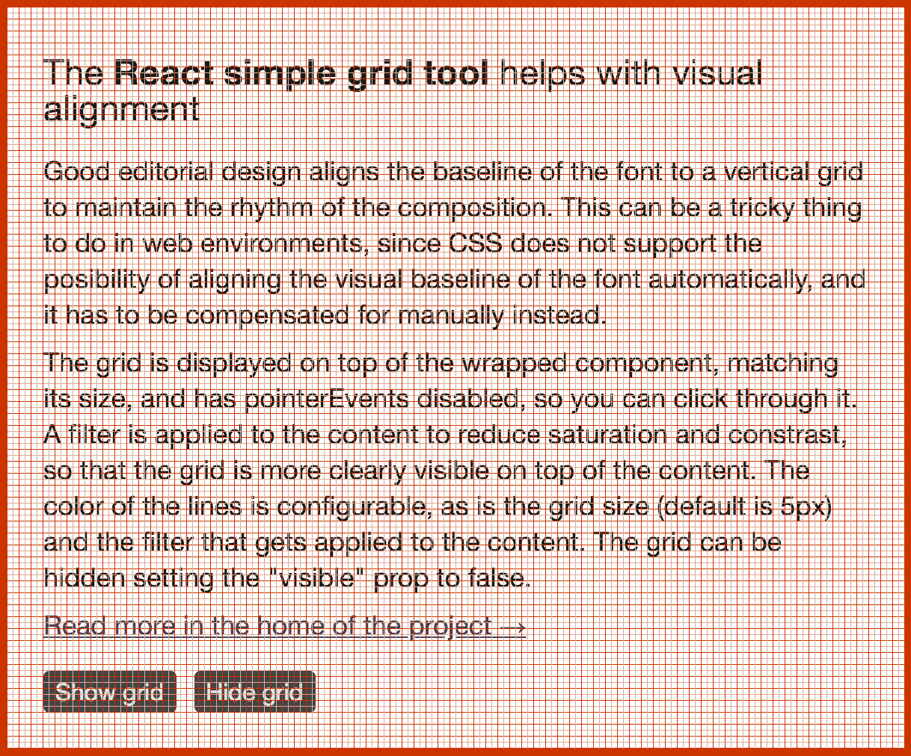

# react-simple-grid-tool

React component for showing a Grid on top of other components - useful for debugging alignment.



## Install

```
yarn add react-simple-grid-tool
```

## Why

Good editorial design aligns the baseline of the font to a vertical grid to maintain the rhythm of the composition. This can be a tricky thing to do in web environments, since CSS does not support the possibility of aligning the visual baseline of the font automatically, and it has to be compensated for manually instead.

## How

The grid is displayed on top of the wrapped component, matching its size, and has pointerEvents disabled, so you can click through it. A filter is applied to the content to reduce saturation and contrast, so that the grid is more clearly visible on top of the content. The color of the lines is configurable, as is the grid size (default is `5px`) and the filter that gets applied to the content. The grid can be hidden setting the `visible` prop to false.

```js
import Grid from 'react-simple-grid-tool'

<Grid
  gridSize={4}
  softLineColor="green"
  hardLineColor="red"
  filter="saturate(0.2) contrast(0.8)"
  visible
>
  <YourComponent />
</Grid>
```

## License

MIT
